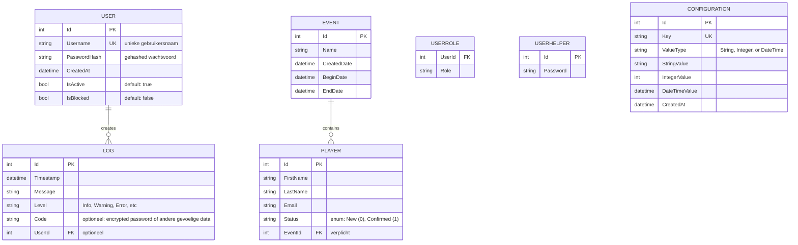

# Metalimes - Razor Pages Application

## 📊 Datamodel

## 🔑 Database Relaties

| Entity | Type | Beschrijving |
|--------|------|-------------|
| **User** | Entity | Gebruikersaccounts met authenticatie |
| **UserRole** | Mapping | Toewijzing van 1 rol per rij; 1 user kan meerdere rollen hebben |
| **Log** | Entity | Audit logs gekoppeld aan gebruikers |
| **Event** | Entity | Evenementen waar spelers zich kunnen registreren |
| **Player** | Entity | Deelnemers van een event |

### User Tabel
- **Id**: Primaire sleutel
- **Username**: Unieke gebruikersnaam (index)
- **Password**: Ongeëncrypteerd wachtwoord (optioneel)
- **PasswordHash**: BCrypt gehashed wachtwoord
- **CreatedAt**: Aanmaakdatum (UTC)
- **IsActive**: Boolean, standaard `true`
- **IsBlocked**: Boolean, standaard `false`

> Rollen worden opgeslagen in de UserRole tabel (1 rij per toegewezen rol).

### Configuration Tabel
- **Id**: Primaire sleutel
- **Key**: Unieke configuratiesleutel (index) - enum waarde (bv. EncryptionKey)
- **ValueType**: Type van de configuratiewaarde - "String", "Integer", of "DateTime"
- **StringValue**: Tekenreeks waarde (optioneel, gebruikt als ValueType = "String")
- **IntegerValue**: Geheel getal waarde (optioneel, gebruikt als ValueType = "Integer")
- **DateTimeValue**: Datum/tijd waarde (optioneel, gebruikt als ValueType = "DateTime")
- **CreatedAt**: Aanmaakdatum (UTC, standaard: CURRENT_TIMESTAMP)

> **Opmerking**: Slechts één waarde (StringValue, IntegerValue, of DateTimeValue) moet ingevuld zijn, afhankelijk van ValueType.

### Events Tabel
- **Id**: Primaire sleutel
- **Name**: Naam van het event
- **CreatedDate**: Datum waarop het event is aangemaakt
- **BeginDate**: Startdatum van het event
- **EndDate**: Einddatum van het event
- **Players**: 0 of meer deelnemers (navigatie)

### Players Tabel
- **Id**: Primaire sleutel
- **FirstName**: Voornaam van de deelnemer
- **LastName**: Achternaam van de deelnemer
- **Email**: E-mailadres van de deelnemer
- **Status**: `New` (standaard) of `Confirmed`
- **EventId**: Vreemde sleutel naar Events (verplicht)
- **Event**: Navigatie naar het gekoppelde event

## 🔐 Encryptie & Wachtwoordbeheer

### Wachtwoordopslag
- **User.PasswordHash**: Het wachtwoord wordt gehashed met BCrypt en opgeslagen in de User tabel
- **UserHelper.Password**: Het geëncrypteerde wachtwoord wordt opgeslagen in de UserHelper tabel (één-op-één relatie met User)

### Encryptie
Wachtwoorden worden geëncrypteerd met AES-256-CBC voordat ze in de database worden opgeslagen:

1. **Encryptie sleutel**: Opgehaald uit de Configuration tabel met key `EncryptionKey`
2. **Sleutel afleiding**: SHA-256 wordt gebruikt om een vaste 32-byte sleutel af te leiden
3. **IV (Initialization Vector)**: Een willekeurige IV wordt gegenereerd voor elke encryptie
4. **Opslag**: IV + ciphertext wordt Base64 gecodeerd en opgeslagen

### Gebruikerscreatie (Registratie)
Bij het aanmaken van een nieuwe gebruiker:
1. Het wachtwoord wordt gehashed en opgeslagen in `User.PasswordHash`
2. **Als EncryptionKey beschikbaar is**:
   - Het wachtwoord wordt geëncrypteerd en opgeslagen in `UserHelper.Password`
   - Een log entry wordt aangemaakt met `Code` = het geëncrypteerde wachtwoord en `Level` = "Info"
3. **Als EncryptionKey NIET beschikbaar is**:
   - Het wachtwoord wordt opgeslagen als empty string (`""`) in `UserHelper.Password`
   - Een log entry wordt aangemaakt met `Code` = empty string en `Level` = "Warning"

### Succesvolle login
Bij een succesvolle login:
1. **Als EncryptionKey beschikbaar is**:
   - Het wachtwoord wordt geëncrypteerd
   - Een log entry wordt aangemaakt met `Code` = het geëncrypteerde wachtwoord en `Level` = "Info"
2. **Als EncryptionKey NIET beschikbaar is**:
   - Een log entry wordt aangemaakt met `Code` = empty string en `Level` = "Warning"

### Mislukte login
Bij een mislukte inlogpoging:
1. **Als EncryptionKey beschikbaar is**:
   - Het ingevoerde wachtwoord wordt geëncrypteerd
   - Een log entry wordt aangemaakt met `Code` = het geëncrypteerde wachtwoord
2. **Als EncryptionKey NIET beschikbaar is**:
   - Een log entry wordt aangemaakt met `Code` = empty string
3. De UserHelper tabel wordt **niet** bijgewerkt (blijft ongewijzigd)

### EncryptionService
De `Services/EncryptionService.cs` klasse biedt:
- `Encrypt(plaintext, key)`: Versleutelt plaintext met AES-256-CBC
- `Decrypt(ciphertext, key)`: Ontsleutelt Base64 gecodeerde ciphertext

## 📊 Relaties

- **Users ↔ Logs**: 1-op-veel (optioneel)
  - Als een user verwijderd wordt, krijgen referentie logs NULL

- **Events ↔ Players**: 1-op-veel (verplicht)
  - Als een event verwijderd wordt, worden alle gekoppelde players verwijderd (CASCADE)

## 👥 Rollen

- **Basic**: Standaard gebruiker (toegang tot Bingo-pagina)
- **Admin**: Administrator (toegang tot Admin Dashboard)
- **Arbiter**: Evaluator / scheidsrechter (rol kan speciale rechten krijgen)
- **Player**: Deelnemer / speler (standaard gebruiker voor events)

> Opmerking: Een User kan meerdere rollen hebben. Roles zijn een [Flags] enum en kunnen gecombineerd worden (bv. `Role.Admin | Role.Arbiter`).

## 📝 Authenticatie

- Cookie-based authentication
- Claims-based authorization
- Automatic user registration op eerste login

## Link naar referentie
https://learn.microsoft.com/en-us/answers/questions/5815581/library-e-sqlite3-not-found
