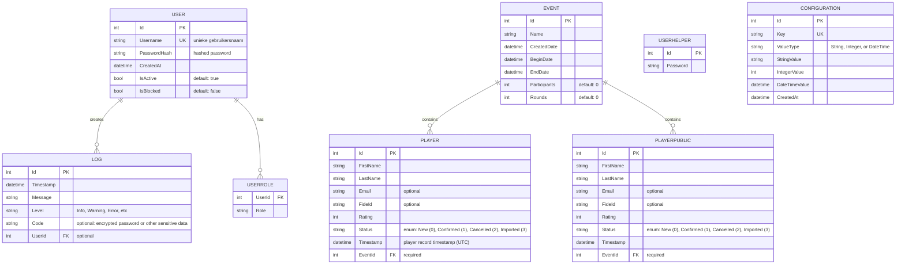

# Metalimes - Razor Pages Application

## 🗺️ Sitemap

| Page | Route | Description | Authorization |
|--------|-------|-------------|-------------|
| **Login** | `/Login` | Login page with username/password | Anonymous |
| **Index** | `/` or `/Index` | Landing page after login | Authenticated |
| **Bingo** | `/Bingo` | Bingo game page | Authenticated |
| **Events** | `/Events` | Event management | Authenticated |
| **Players** | `/Players?eventId={id}` | Player management per event (CRUD) | Authenticated |
| **Public Players** | `/PlayersPublic?eventId={id}` | Public event player view + public registration | Public |
| **All Events** | `/AllEvents` | Public event overview | Public |
| **My Welcome** | `/MyWelcome` | Welcome page for user | Authenticated |
| **Privacy** | `/Privacy` | Privacy page | Public |
| **Logout** | `/Logout` | Logout handler (POST) | Authenticated |
| **Admin Dashboard** | `/Admin` | Admin user management & logs | Admin only |
| **Configuration Management** | `/ConfigurationManagement` | System configuration management | Admin only |
| **Error** | `/Error` | Error page | Always reachable |

### Page Details

#### Public Pages
- **Login** (`/Login`): Login form for users
- **Privacy** (`/Privacy`): Privacy policy
- **All Events** (`/AllEvents`): Public list of events
- **Public Players** (`/PlayersPublic?eventId={id}`):
  - Public event player list
  - Public registration to `PlayerPublic`

#### Authenticated Pages
- **Index** (`/`): Home page with welcome message
- **Bingo** (`/Bingo`): Bingo game interface
- **Events** (`/Events`): Event overview and management
  - Create form defaults: `BeginDate` = tomorrow, `EndDate` = tomorrow
- **Players** (`/Players?eventId={id}`):
  - Add, edit, and delete players within an event
  - View `PlayerPublic` records for the same event
  - Import `PlayerPublic` one-by-one into `Player`
  - Imported public records are marked with status `Imported`
- **My Welcome** (`/MyWelcome`): Personal welcome page
- **Logout** (`/Logout`): Logout processing (POST-only)

#### Admin Pages (Admin role only)
- **Admin Dashboard** (`/Admin`): 
  - User management (create, read, update, delete)
  - Logs viewer
  - Role assignment
- **Configuration Management** (`/ConfigurationManagement`):
  - Manage system configurations
  - Encryption key management
  - Application settings

#### Error Handling
- **Error** (`/Error`): Central error handling page

---

## 📊 Datamodel

```mermaid
erDiagram
    USER ||--o{ LOG : creates
    EVENT ||--o{ PLAYER : contains
    EVENT ||--o{ PLAYERPUBLIC : contains
    USER ||--o{ USERROLE : has

    USER {
        int Id PK
        string Username UK "unieke gebruikersnaam"
        string PasswordHash "hashed password"
        datetime CreatedAt
        bool IsActive "default: true"
        bool IsBlocked "default: false"
    }

    USERROLE {
        int UserId FK
        string Role
    }

    USERHELPER {
        int Id PK
        string Password
    }

    CONFIGURATION {
        int Id PK
        string Key UK
        string ValueType "String, Integer, or DateTime"
        string StringValue
        int IntegerValue
        datetime DateTimeValue
        datetime CreatedAt
    }

    LOG {
        int Id PK
        datetime Timestamp
        string Message
        string Level "Info, Warning, Error, etc"
        string Code "optional: encrypted password or other sensitive data"
        int UserId FK "optional"
    }

    EVENT {
        int Id PK
        string Name
        datetime CreatedDate
        datetime BeginDate
        datetime EndDate
        int Participants "default: 0"
        int Rounds "default: 0"
    }

    PLAYER {
        int Id PK
        string FirstName
        string LastName
        string Email "optional"
        string FideId "optional"
        int Rating
        string Status "enum: New (0), Confirmed (1), Cancelled (2), Imported (3)"
        datetime Timestamp "player record timestamp (UTC)"
        int EventId FK "required"
    }

    PLAYERPUBLIC {
        int Id PK
        string FirstName
        string LastName
        string Email "optional"
        string FideId "optional"
        int Rating
        string Status "enum: New (0), Confirmed (1), Cancelled (2), Imported (3)"
        datetime Timestamp
        int EventId FK "required"
    }
```

## 🔑 Database Relationships

| Entity | Type | Beschrijving |
|--------|------|-------------|
| **User** | Entity | User accounts with authentication |
| **UserRole** | Mapping | One role per row; one user can have multiple roles |
| **Log** | Entity | Audit logs linked to users |
| **Event** | Entity | Events where players can register |
| **Player** | Entity | Participants of an event |
| **PlayerPublic** | Entity | Public registrations per event |

### User Table
- **Id**: Primary key
- **Username**: Unique username (index)
- **Password**: Unencrypted password (optional)
- **PasswordHash**: BCrypt hashed password
- **CreatedAt**: Creation date (UTC)
- **IsActive**: Boolean, default `true`
- **IsBlocked**: Boolean, default `false`

> Roles are stored in the UserRole table (1 row per assigned role).

### Configuration Table
- **Id**: Primary key
- **Key**: Unique configuration key (index) - enum value (e.g., EncryptionKey)
- **ValueType**: Type of configuration value - "String", "Integer", or "DateTime"
- **StringValue**: String value (optional, used when ValueType = "String")
- **IntegerValue**: Integer value (optional, used when ValueType = "Integer")
- **DateTimeValue**: Date/time value (optional, used when ValueType = "DateTime")
- **CreatedAt**: Creation date (UTC, default: CURRENT_TIMESTAMP)

> **Note**: Only one value (StringValue, IntegerValue, or DateTimeValue) should be set, depending on ValueType.

### Events Table
- **Id**: Primary key
- **Name**: Event name
- **CreatedDate**: Date when event was created
- **BeginDate**: Event start date
- **EndDate**: Event end date
- **Participants**: Maximum number of participants (default `0`)
- **Rounds**: Number of rounds (default `0`)
- **Players**: 0 or more participants (navigation)

### Players Table
- **Id**: Primary key
- **FirstName**: Player first name
- **LastName**: Player last name
- **Email**: Player email address (optional)
- **FideId**: FIDE identification number (optional)
- **Rating**: Integer rating (e.g., Elo)
- **Status**: `New` (default), `Confirmed`, `Cancelled`, or `Imported`
- **Timestamp**: Player record timestamp (UTC)
- **EventId**: Foreign key to Events (required)
- **Event**: Navigation to the linked event

### PlayerPublic Table
- **Id**: Primary key
- **FirstName**: Player first name
- **LastName**: Player last name
- **Email**: Player email address (optional)
- **FideId**: FIDE identification number (optional)
- **Rating**: Integer rating (e.g., Elo)
- **Status**: `New` (default), `Confirmed`, `Cancelled`, or `Imported`
- **Timestamp**: Record timestamp (UTC)
- **EventId**: Foreign key to Events (required)
- **Event**: Navigation to the linked event

## 🛠️ Admin Features

### User Management
The Admin Dashboard provides full user management:

#### Create New User
- **Required**: Username and password
- **Password**: Hashed with BCrypt and stored in User.PasswordHash
- **Encryption**: If EncryptionKey is available, password is also encrypted and stored in UserHelper.Password
- **Roles**: Default "Basic" role is assigned; additional roles can be selected

#### Update Existing User
- **Username**: Can always be changed (must remain unique)
- **Password**: OPTIONAL
  - Leave empty → current password remains unchanged
  - Fill in → password is updated with the new value
- **Roles**: Can be assigned or removed
- **Validation**:
  - Server-side: NewPassword field is optional on updates, but required on create
  - Client-side: `required` attribute is dynamically managed via JavaScript
- **Admin role constraints**:
  - Admin users are always `IsActive = true`
  - Admin users are always `IsBlocked = false`
  - In update popup, `IsActive`/`IsBlocked` fields are hidden for Admin users

## 🔐 Login Rules

- Login is allowed only when user is active and not blocked.
- Admin users are enforced as active and not blocked.
- Authentication errors are returned as a generic message.

## 🔄 PlayerPublic Import Flow

- On `/Players?eventId={id}`, a `PlayerPublic` list is shown under the player list.
- Each row has one import action.
- Import creates a new `Player` row for the same event.
- After import, `PlayerPublic.Status` is set to `Imported`.

#### Admin Dashboard Features
- All users table with:
  - ID, Username, Creation date
  - Decrypted password (if available from UserHelper)
  - Password status (Decrypted/Error/Not available)
  - Toegewezen rollen
  - Edit/Delete acties
- Alle logs tabel met volledige audit trail
- Gebruiker search/filter mogelijkheden

---

## 🔐 Encryptie & Wachtwoordbeheer

### Wachtwoordopslag
- **User.PasswordHash**: Het wachtwoord wordt gehashed met BCrypt en opgeslagen in de User tabel
- **UserHelper.Password**: Het geëncrypteerde wachtwoord wordt opgeslagen in de UserHelper tabel (één-op-één relatie met User)

### Encryptie
Wachtwoorden worden geëncrypteerd met AES-256-CBC voordat ze in de database worden opgeslagen:

1. **Encryptie sleutel**: Opgehaald uit de Configuration tabel met key `EncryptionKey`
2. **Sleutel afleiding**: SHA-256 wordt gebruikt om een vaste 32-byte sleutel af te leiden
3. **IV (Initialization Vector)**: Een willekeurige IV wordt gegenereerd voor elke encryptie
4. **Opslag**: IV + ciphertext wordt Base64 gecodeerd en opgeslagen

### Gebruikerscreatie (Registratie)
Bij het aanmaken van een nieuwe gebruiker:
1. Het wachtwoord wordt gehashed en opgeslagen in `User.PasswordHash`
2. **Als EncryptionKey beschikbaar is**:
   - Het wachtwoord wordt geëncrypteerd en opgeslagen in `UserHelper.Password`
   - Een log entry wordt aangemaakt met `Code` = het geëncrypteerde wachtwoord en `Level` = "Info"
3. **Als EncryptionKey NIET beschikbaar is**:
   - Het wachtwoord wordt opgeslagen als empty string (`""`) in `UserHelper.Password`
   - Een log entry wordt aangemaakt met `Code` = empty string en `Level` = "Warning"

### Succesvolle login
Bij een succesvolle login:
1. **Als EncryptionKey beschikbaar is**:
   - Het wachtwoord wordt geëncrypteerd
   - Een log entry wordt aangemaakt met `Code` = het geëncrypteerde wachtwoord en `Level` = "Info"
2. **Als EncryptionKey NIET beschikbaar is**:
   - Een log entry wordt aangemaakt met `Code` = empty string en `Level` = "Warning"

### Mislukte login
Bij een mislukte inlogpoging:
1. **Als EncryptionKey beschikbaar is**:
   - Het ingevoerde wachtwoord wordt geëncrypteerd
   - Een log entry wordt aangemaakt met `Code` = het geëncrypteerde wachtwoord
2. **Als EncryptionKey NIET beschikbaar is**:
   - Een log entry wordt aangemaakt met `Code` = empty string
3. De UserHelper tabel wordt **niet** bijgewerkt (blijft ongewijzigd)

### EncryptionService
De `Services/EncryptionService.cs` klasse biedt:
- `Encrypt(plaintext, key)`: Versleutelt plaintext met AES-256-CBC
- `Decrypt(ciphertext, key)`: Ontsleutelt Base64 gecodeerde ciphertext

## 📊 Relaties

- **Users ↔ Logs**: 1-op-veel (optioneel)
  - Als een user verwijderd wordt, krijgen referentie logs NULL

- **Events ↔ Players**: 1-op-veel (verplicht)
  - Als een event verwijderd wordt, worden alle gekoppelde players verwijderd (CASCADE)

## 👥 Rollen

- **Basic**: Standaard gebruiker (toegang tot Bingo-pagina)
- **Admin**: Administrator (toegang tot Admin Dashboard)
- **Arbiter**: Evaluator / scheidsrechter (rol kan speciale rechten krijgen)
- **Player**: Deelnemer / speler (standaard gebruiker voor events)

> Opmerking: Een User kan meerdere rollen hebben. Roles zijn een [Flags] enum en kunnen gecombineerd worden (bv. `Role.Admin | Role.Arbiter`).

## 📝 Authenticatie

- Cookie-based authentication
- Claims-based authorization
- Automatic user registration op eerste login

## Link naar referentie
https://learn.microsoft.com/en-us/answers/questions/5815581/library-e-sqlite3-not-found

## API
https://parse.bot/marketplace/6bbce1ef-d137-46c5-ba78-fda6015026e1/ratings-fide-com-api
